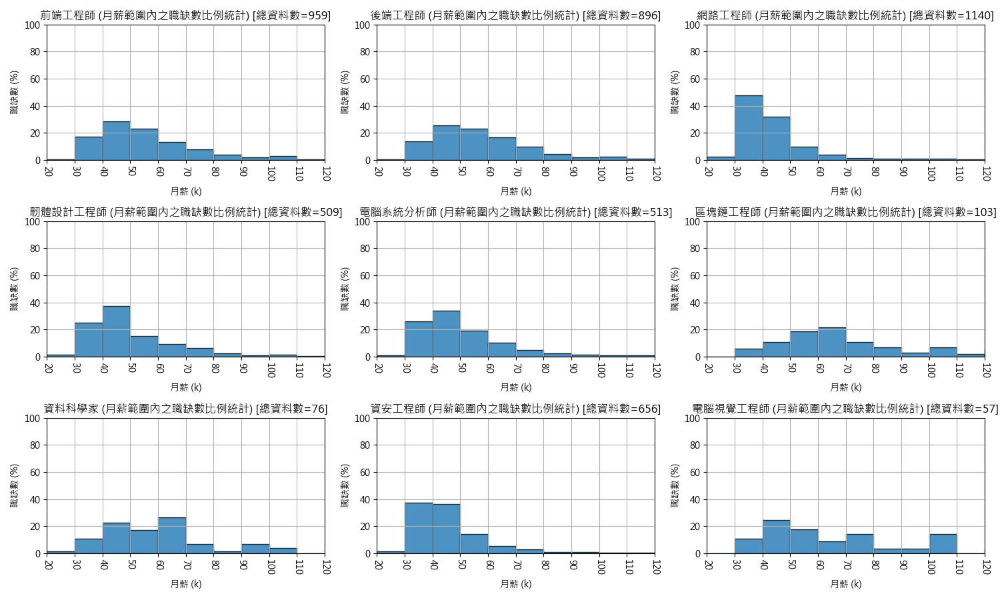
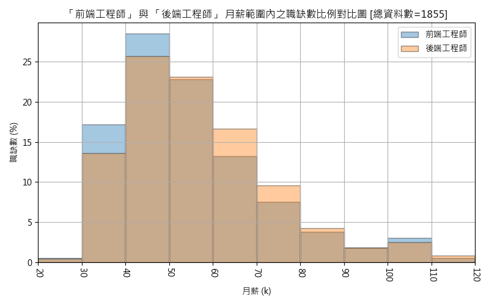
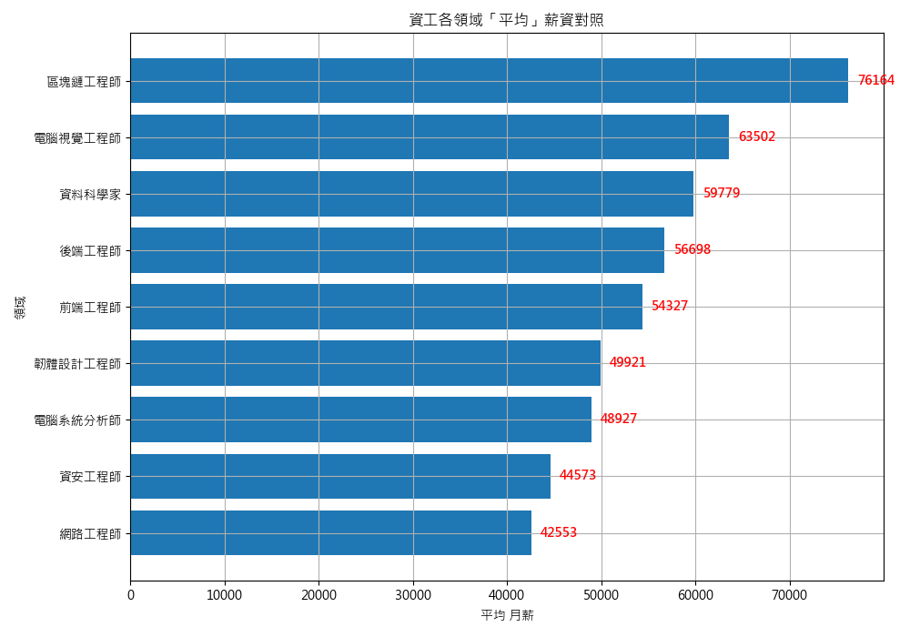
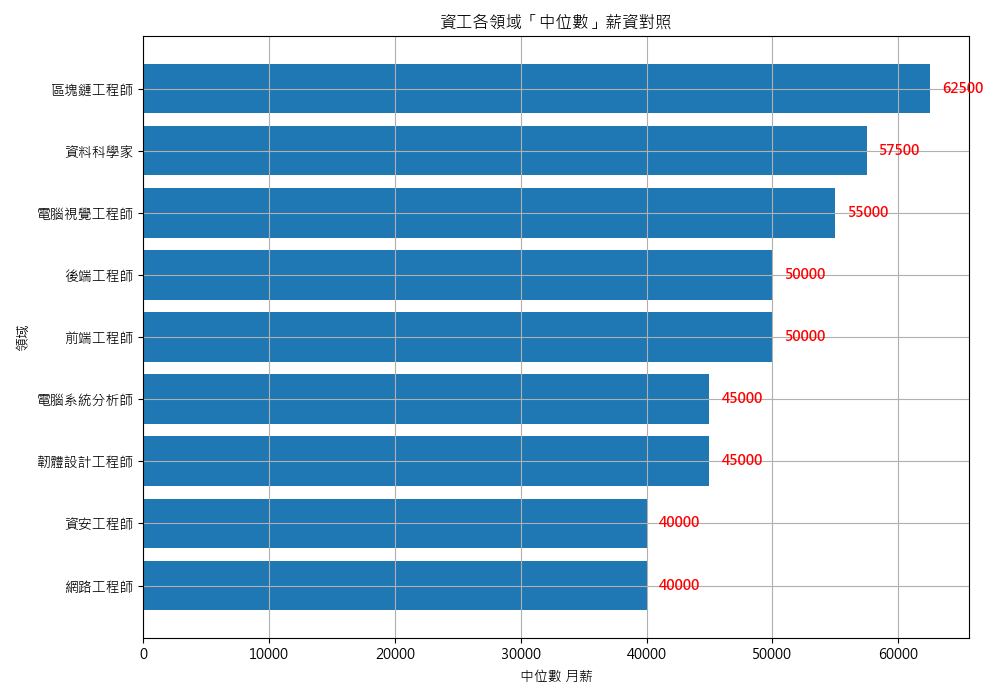
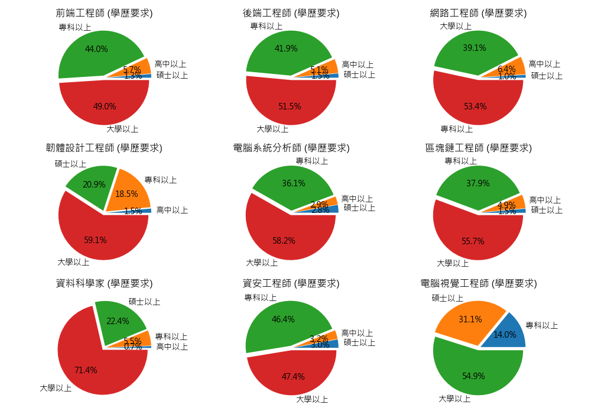
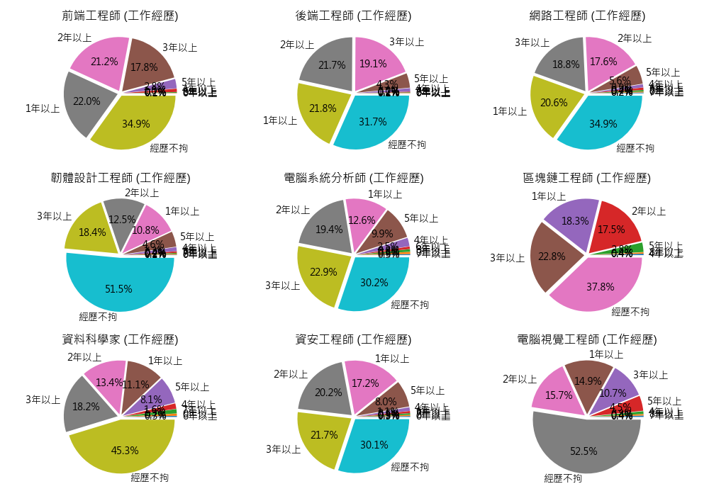

# 資訊工程 職涯領域分析 
本專案於104人力銀行進行爬蟲處理，將所取得資訊(月薪、年薪、工作經歷、學歷要求、所需具備技能)做一個分析並將各領域相互比對<br><br>
如需查找某個領域相關的資訊，可以自行運行程式，修改原始碼下方test部分，將最前面一項或兩項更改為您要的查找名稱及爬的網址。

```python
test = {
'前端工程師': 'https://www.104.com.tw/jobs/search/?keyword=%E5%89%8D%E7%AB%AF%E5%B7%A5%E7%A8%8B%E5%B8%AB&order=1&jobsource=2018indexpoc&ro=0',
'後端工程師': 'https://www.104.com.tw/jobs/search/?keyword=%E5%BE%8C%E7%AB%AF%E5%B7%A5%E7%A8%8B%E5%B8%AB&order=1&jobsource=2018indexpoc&ro=0',
'網路工程師': 'https://www.104.com.tw/jobs/search/?ro=0&keyword=%E7%B6%B2%E8%B7%AF%E5%B7%A5%E7%A8%8B%E5%B8%AB&expansionType=area%2Cspec%2Ccom%2Cjob%2Cwf%2Cwktm&order=1&asc=0&page=1&mode=s&jobsource=2018indexpoc&langFlag=0&langStatus=0&recommendJob=1&hotJob=1',
'韌體設計工程師': 'https://www.104.com.tw/jobs/search/?ro=0&keyword=%E9%9F%8C%E9%AB%94%E8%A8%AD%E8%A8%88%E5%B7%A5%E7%A8%8B%E5%B8%AB&expansionType=area%2Cspec%2Ccom%2Cjob%2Cwf%2Cwktm&order=1&asc=0&page=1&mode=s&jobsource=2018indexpoc&langFlag=0&langStatus=0&recommendJob=1&hotJob=1',
'電腦系統分析師': 'https://www.104.com.tw/jobs/search/?ro=0&keyword=%E9%9B%BB%E8%85%A6%E7%B3%BB%E7%B5%B1%E5%88%86%E6%9E%90%E5%B8%AB&expansionType=area%2Cspec%2Ccom%2Cjob%2Cwf%2Cwktm&order=1&asc=0&page=1&mode=s&jobsource=2018indexpoc&langFlag=0&langStatus=0&recommendJob=1&hotJob=1',
'區塊鏈工程師': 'https://www.104.com.tw/jobs/search/?ro=0&keyword=%E5%8D%80%E5%A1%8A%E9%8F%88%E5%B7%A5%E7%A8%8B%E5%B8%AB&expansionType=area%2Cspec%2Ccom%2Cjob%2Cwf%2Cwktm&order=1&asc=0&page=1&mode=s&jobsource=2018indexpoc&langFlag=0&langStatus=0&recommendJob=1&hotJob=1',
'資料科學家': 'https://www.104.com.tw/jobs/search/?ro=0&keyword=%E8%B3%87%E6%96%99%E7%A7%91%E5%AD%B8%E5%AE%B6&expansionType=area%2Cspec%2Ccom%2Cjob%2Cwf%2Cwktm&order=1&asc=0&page=1&mode=s&jobsource=2018indexpoc&langFlag=0&langStatus=0&recommendJob=1&hotJob=1',
'資安工程師': 'https://www.104.com.tw/jobs/search/?ro=0&keyword=%E8%B3%87%E5%AE%89%E5%B7%A5%E7%A8%8B%E5%B8%AB&expansionType=area%2Cspec%2Ccom%2Cjob%2Cwf%2Cwktm&order=1&asc=0&page=1&mode=s&jobsource=2018indexpoc&langFlag=0&langStatus=0&recommendJob=1&hotJob=1',
'電腦視覺工程師': 'https://www.104.com.tw/jobs/search/?ro=0&keyword=%E9%9B%BB%E8%85%A6%E8%A6%96%E8%A6%BA%E5%B7%A5%E7%A8%8B%E5%B8%AB&expansionType=area%2Cspec%2Ccom%2Cjob%2Cwf%2Cwktm&order=1&asc=0&page=1&mode=s&jobsource=2018indexpoc&langFlag=0&langStatus=0&recommendJob=1&hotJob=1'
}
```

---



### 標題
九種領域 (前端、後端、網路、韌體、電腦系統分析、區塊鏈、資料科學、資安、電腦視覺) 薪資範圍內之職缺數比例對比圖<br>
### 說明
以抓取到的月薪做一個範圍的統計，例如第一張圖的前端工程師，橫軸處月薪40k~50k之間，對到縱軸約30%，意味總資料數959筆中佔了30%的數量在該月薪範圍內。<br>

而觀看結果似乎
* 「網路工程師」、 「韌體設計工程師」、 「資安工程師」在五年內，至高五萬左右就極限了。
* 「電腦系統分析師」能穩定在五年內在月薪六至七萬左右。
* 「區塊鏈」、「電腦視覺」、「資料科學家」，薪資區段都很平均，也可以說，好的可以到很好、差的可以到很差。
* 「前端工程師」、「後端工程師」的圖非常的相近，但實質還是有些微差異，之後會特別放大這兩個來看。
### 備註
由於抓取到的月薪資料標準是以(xxx以上、xxx ~ xxx元)，前者數值直接取，後者是相加除二來存，所以數值可以當作起薪或工作五年內可能的月薪範圍。<br>

---


### 標題
上圖的九種領域重疊的混合圖
### 說明
從月薪70k ~ 120k範圍內，可以觀察到由(區塊鏈工程師、電腦視覺工程師、資料科學家)佔據多數，而30k ~ 50k可以看到(網路工程師、韌體工程師)佔多數。

---



### 標題
「前端工程師」與「後端工程師」的月薪範圍內之職缺數比例重疊對比圖
### 說明
可明顯觀察到，月薪在30k ~ 50k，前端遠遠高出後端，而60k~80k則是後端高於前端。<br>
如果實際計算的話，以60k ~ 70k為例，假設資料各佔900筆，且多出部分佔了3/4格，換算後是33.75個職缺數。

也就是說1855個職缺內，在薪資60k ~ 70k範圍內，後端有比前端多出33.75個職缺。<br>

---



### 標題
九個領域的平均月薪排名
### 說明
從最高的區塊鏈76k到前端54k都有達到五萬以上，而末三名為網路、資安、電腦系統分析。

---



### 標題
九個領域的中位數月薪排名
### 說明
超越五萬的有區塊鏈、電腦視覺、資料科學家、後端、前端，整體排序與平均月薪想比其實變動不大，唯一變動的是，可看到月薪在以中位數來看時皆下降了，也意味職缺中中低薪佔據了大部分，而極少職缺開出的高薪有顯著落差，呈現斷層，導致此現象。

---



### 標題
九個領域的學歷要求對比圖
### 說明
可先將專科、高中、大學視為一體，因為在台灣大部分人皆有滿足，也就是剩下碩士是我們很關切的，以下是經過分析列出最高三名的排序。<br>
* 電腦視覺：碩士31.1%
* 資料科學：碩士22.5%
* 韌體設計：碩士20.4%

其餘部分通常大學畢即可。<br>

---



### 標題
九個領域的工作經歷對比圖
### 說明
從經歷不拘的部分先看，以下是列出最高三名的領域。
* 電腦視覺：52.5%
* 韌體設計：51.6%
* 資料科學家：45.3%

從這邊可以明顯看到，比照學歷要求最高三名，發現一模一樣，也可以合理推斷如果走這三個領域，並且唸到碩士，可以無需工作經歷直接進入職場的，也許是將碩士生涯研究經驗已經考量進去。<br>

再來將1、2、3年以上合併來看，可以觀察到如下狀況。
* 後端：61.9% (最高)
* 前端：60.2%
* 資安：59.1%
* 區塊鏈：58.6%
* 網路：57.2%

其實相差不大，而以後端領域最高來看，似乎較看中是否有過去工作經驗。

---

名次排序 | 前端工程師 | 後端工程師 | 網路工程師 | 韌體設計工程師 | 電腦系統分析師 | 區塊鏈工程師 | 資料科學家 | 資安工程師 | 電腦視覺工程師
-|-|-|-|-|-|-|-|-|-
1 | API | API | Linux | C | SQL | API | AI | Linux | C
2 | CSS | Web | Windows | Linux | Java | js | Python | Windows | AI
3 | UI | UI | Server | MCU | NFT | C | Data | Server | D 
4 | Vue | PHP | Switch | Android | NET | Blockchain | Machine | IT | Python
5 | Web | UX | IT | Embedded | SAP | App | Learning | AD | AlfredCamera
6 | HTML | Git | Firewall | development | ERP | Git | C | Switch | API
7 | UX | js | Cisco | BIOS | Web | JavaScript | ETL | Firewall | learning
8 | JavaScript | Java | AD | IC | API | React | BI | IPS | Deep
9 | js | C | IP | ARM | Oracle | AI | data | Cisco | IOS
10 | React | CSS | Router | FPGA | ASP | Vue | SQL | IP | Computer
11 | HTML5 | SQL | ERP | driver | Linux | blockchain | D | ERP | AR
12 | RWD | MySQL | AWS | G | MVC | Web | learning | Router | Vision
13 | Javascript | JavaScript | VPN | system | SA | Solidity | API | C | Android
14 | Git | Vue | TCP | firmware | BI | Node | NLP | WAF | Linux
15 | CSS3 | HTML | NAS | AI | Python | Python | Big | Security | VR
16 | C | PM | DNS | Windows | Spring | DeFi | TenMax | AWS | Learning
17 | PM | RESTful | GCP | Driver | Net | C | Deep | TCP | Edge
18 | Angular | APP | MIS | USB | MS | Golang | ML | DNS | vision
19 | Java | Python | PC | FW | JavaScript | iOS | pipeline | SIEM | deep
20 | APP | Javascript | VMware | I2C | AI | Android | UI | VMware | js

### 標題
在該領域工作內容時常強調的字串排名
### 說明
由於在資訊領域，以英文與數字組成的字串，常被視為技能、軟體的專有名詞，所以利用這樣的規則，去統計該領域所有工作內容資料的抓取，做一個數量上的排名。<br>

缺點部分缺乏中文專有名詞的收集，未來專案更新會加強這部分處理，以目前分析做一個英文資訊的基本參考。