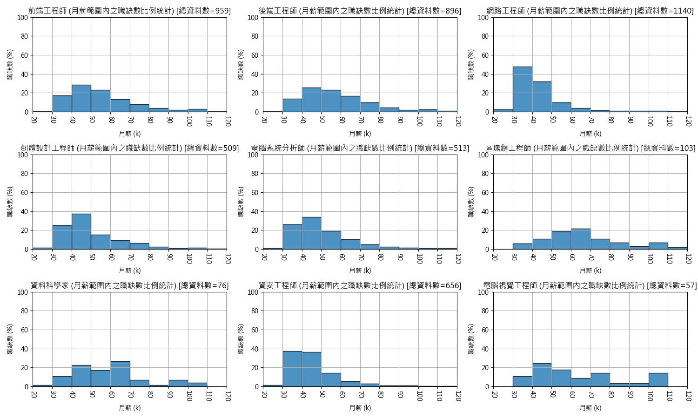
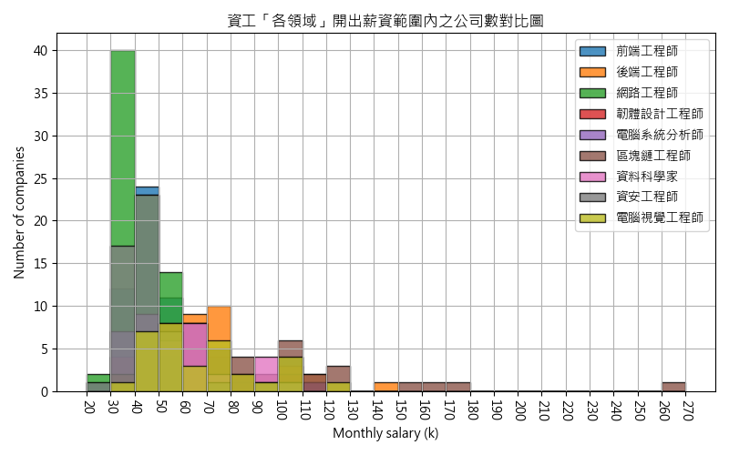
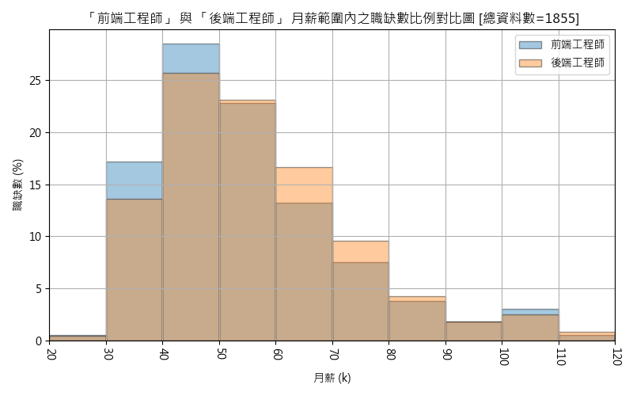
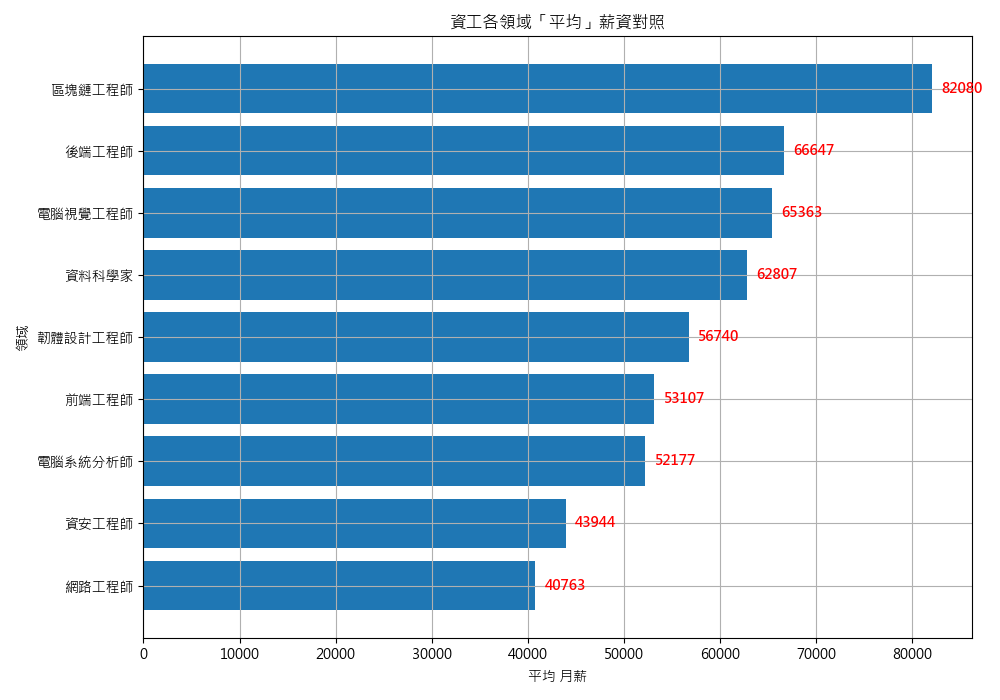
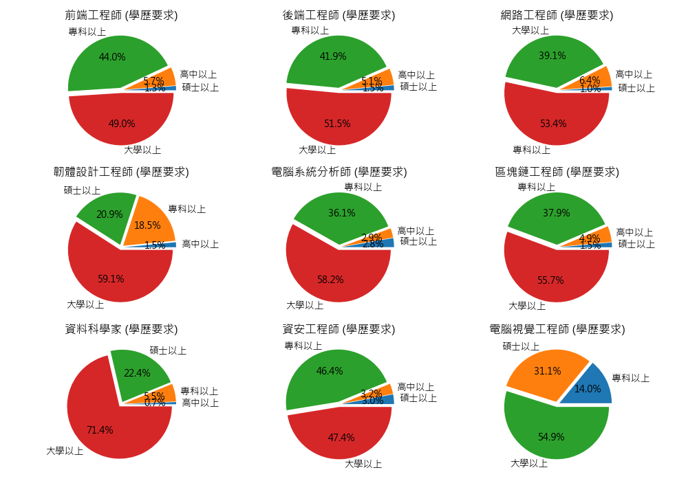
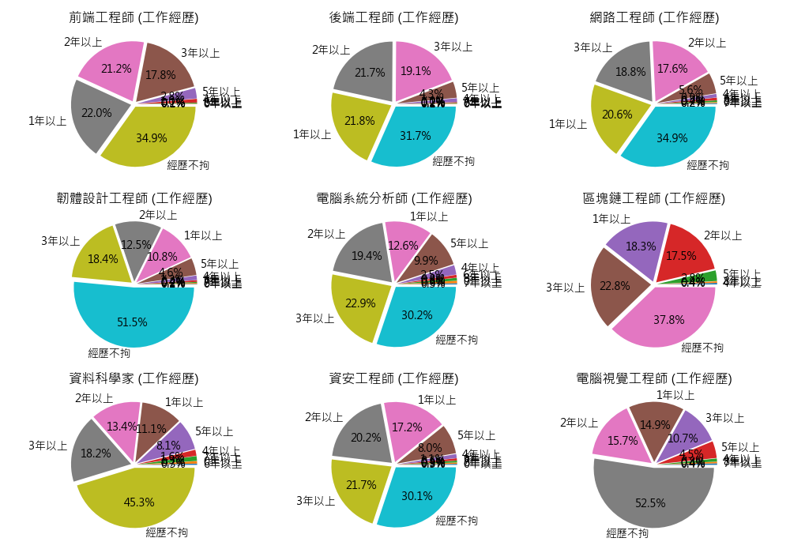

# 資訊工程 職涯領域分析 
## 本專案於104人力銀行進行爬蟲處理，將所取得資訊(月薪、年薪、工作經歷、學歷要求、所需具備技能)做一個分析並將各領域相互比對。 
---

### 標題
九種領域(前端、後端、網路、韌體、電腦系統分析、區塊鏈、資料科學、資安、電腦視覺) 薪資範圍的職缺比例對比分析圖 

### 說明
以抓取到的月薪做一個範圍的統計，例如第一張圖的前端工程師，橫軸處月薪40k~50k之間，對到縱軸約30%，意味總資料數959筆中佔了30%的數量在該月薪範圍內。 

### 備註
由於抓取到的月薪資料標準是以(xxx以上、xxx ~ xxx元)，前者數值直接取，後者是相加除二來存，所以數值可以當作起薪或工作五年內可能的月薪範圍。 

---

### 標題
上圖的九種領域重疊的混合圖

### 說明
從月薪70k ~ 120k範圍內，可以觀察到由(區塊鏈工程師、電腦視覺工程師、資料科學家)佔據多數，而30k ~ 50k可以看到(網路工程師、韌體工程師)佔多數。

---

### 標題
「前端工程師」與「後端工程師」的月薪範圍職缺數重疊對比圖

### 說明
可明顯觀察到，月薪在30k ~ 50k，前端遠遠高出後端，而60k~80k則是後端高於前端。 
如果實際計算的話，以60k ~ 70k為例，假設資料各佔900筆，且多出部分佔了3/4格，換算後是33.75個職缺數，也就是1855個職缺內，在薪資60k ~ 70k範圍內，後端有比前端多出33.75個職缺。 

---

### 標題
待補
### 說明
待補

---

### 標題
待補
### 說明
待補

---

### 標題
待補
### 說明
待補

---

### 標題
待補
### 說明
待補

